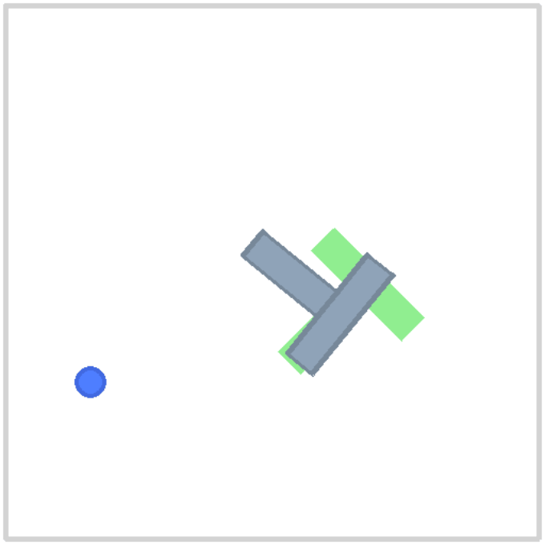
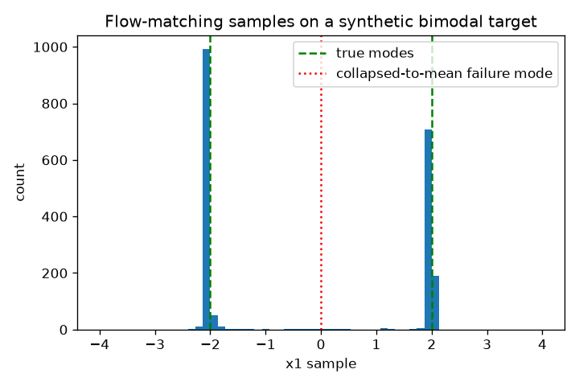
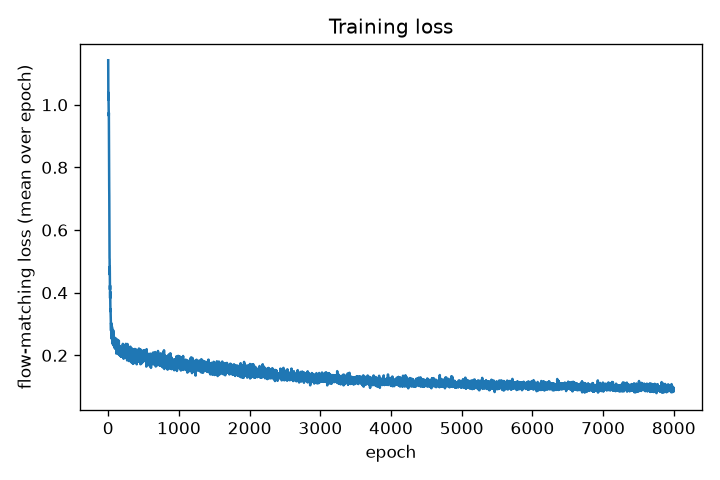

# flow-policy

## Project framing

This is **not** a VLA. It is a small, honest artifact: a language-conditioned
imitation-learning policy with a flow-matching action head, trained on a toy
manipulation task, wrapped in a ROS2 interface. The point is to demonstrate real
engineering decisions (conditioning, multimodal action generation, action
chunking, deployment plumbing) at a scale that's actually verifiable in a
weekend — not to overclaim scope.

## At a glance

A CLIP-conditioned flow-matching policy learns to push a T-shaped block to
one of two named targets on the PushT board, from 200 scripted-expert
demonstrations, entirely on CPU.

| | |
|---|---|
| **Proof the flow-matching head works at all** | On a synthetic bimodal target (`x1 = +-2`), sampled points split ~45/54% across the true modes with 0.4% collapsed to the mean — the exact failure mode plain MSE regression has ([Milestone 4](#milestone-4--flow-matching-action-head)). |
| **Real closed-loop rollouts** | Seeded spot-checks push the block to the correct target with visible, deliberate motion ([Milestone 6](#milestone-6--inference-ode-sampling--action-chunking)). |
| **Real evaluation numbers (N=25/variant)** | Success 28% (left) / 8% (right); instruction-confusion only 8%/20% — most failures are imprecise landing, not the language routing to the wrong side ([Milestone 7](#milestone-7--evaluation-harness--metrics)). |




### Architecture

```
instruction (str) --> frozen CLIP text encoder --> cached embed (512) --\
                                                                          >--> concat --> proj --> cond (128)
state obs (5,)    --> small MLP encoder --> obs embed (64) -------------/                              |
                                                                                                          v
noise x0 ~ N(0,I) (16,) --\                                                              v_theta(xt, t, cond)
                            >--> xt = (1-t)x0 + t*x1 -------------------------------------> (MLP, predicts velocity)
ground truth x1 (16,) ----/                                                                              |
                                                                                                          v
                                                          Euler-integrate dx/dt = v_theta, t: 0 -> 1, 10 steps
                                                                                                          |
                                                                                                          v
                                                        action chunk (H=8, 2) --> receding horizon (execute 4, replan)
                                                                                                          |
                                                                                                          v
                                                                                            gym-pusht env / ROS2 topics
```

`x1` is a flattened `H=8`-step action chunk (`16` = `8*2`); training samples
`t` and `x0` fresh per example and regresses `v_theta` toward `x1 - x0` via
MSE — see [Milestone 4](#milestone-4--flow-matching-action-head)
for why this reproduces multimodal action distributions instead of averaging
them away.

### Reproduce

```bash
uv sync
uv run python scripts/smoke_test_env.py     # M0: sanity-check the env
uv run python scripts/collect_data.py       # M1: 200 scripted-expert episodes
uv run python scripts/inspect_batch.py      # M2: dataset shape/index checks
uv run python scripts/test_conditioning.py  # M3: conditioning encoder unit test
uv run python scripts/test_flow_matching_bimodal.py  # M4: bimodal proof-of-correctness
uv run python scripts/train.py              # M5: train (10000 epochs, ~2 min on CPU)
uv run python scripts/rollout.py            # M6: closed-loop rollout -> GIFs
uv run python scripts/evaluate.py           # M7: N=25/variant evaluation harness
```

### What I'd do with more time or compute

- **Fix the scripted expert's blind spot.** It only pushes toward the goal
  *position* and never corrects the block's rotation, which is why this
  project's whole success metric had to be redefined around position only
  ([Milestone 1](#milestone-1--task-variants--scripted-expert--data-collection)).
  A real rotate-then-translate controller (or just more scripted-expert
  engineering time) would let the eval use PushT's actual 95%-coverage
  criterion instead of a relaxed one.
- **More demonstrations and a bigger model.** 200 episodes and a small MLP
  action head got real but modest closed-loop success (28%/8%); this is
  the single biggest lever on the Milestone 7 numbers.
- **Pixel observations + a real vision backbone.** The plan's low-dim-state
  path was the right first cut for a weekend, but a small CNN (or a frozen
  pretrained backbone) over the 96x96 RGB observation is the natural next
  step, and would make FiLM conditioning (instead of concatenation) worth
  its complexity.
- **A harder, genuinely multimodal real task.** The two PushT variants prove
  conditioning routes correctly, but neither one actually needs multimodal
  action generation to solve — the synthetic bimodal test is still the only
  place this project demonstrates *why* flow matching over MSE regression.
  A task with real left/right/either-works ambiguity at a single state would
  make that case on real data, not just a toy target.
- **Tune the receding-horizon/temporal-ensembling tradeoff properly.**
  Milestone 6 found that committing to the full 8-step chunk beat the plan's
  specified 4-step replanning on the current checkpoint — worth revisiting
  once the underlying policy is stronger, rather than as a workaround for it.
- **Actually run the Milestone 8 ROS2 nodes** against a real ROS2 install
  rather than a syntax-checked, never-executed stub.

A scope note in the same spirit: the plan's own budget was ~800 lines of
code total; this repo is at ~1490 (`src/flow_policy` + `scripts` +
`ros2_nodes`), including a 9-way milestone split where each gets its own
argparse-CLI script, and ~160 lines of never-executed ROS2 stub. The
scripted expert itself went through several rewritten strategies while
debugging Milestone 1 (see that section for why), but only the final,
working version — 83 lines — is in the repo; the throwaway tuning scripts
were deleted once they'd done their job. Noting the overage rather than
quietly not mentioning it.

## Status

- [x] Milestone 0 — environment setup
- [x] Milestone 1 — task env + scripted expert data collection
- [x] Milestone 2 — dataset + dataloader
- [x] Milestone 3 — vision + language conditioning encoder
- [x] Milestone 4 — flow-matching action head
- [x] Milestone 5 — training loop + sanity checks
- [x] Milestone 6 — inference: ODE sampling + action chunking
- [x] Milestone 7 — evaluation harness + metrics
- [~] Milestone 8 — ROS2 wrapper (documented stub, not run — see below)
- [x] Milestone 9 — README, video, polish

## Milestone 0 — Environment setup

Task/env: [`gym-pusht`](https://github.com/huggingface/gym-pusht) (PushT), installed via `uv`.

```bash
uv sync
uv run python scripts/smoke_test_env.py
```

Confirms `reset`/`step`/`render` all work end-to-end and saves a GIF of a
random-action rollout to `assets/smoke_test_random_rollout.gif`.

Note: `gym-pusht` declares `pymunk>=6.6.0`, but pymunk 7.x removed
`Space.add_collision_handler`, which `gym-pusht==0.1.6` still relies on. Pinned
`pymunk<7` in `pyproject.toml` to work around this.


## Milestone 1 — Task variants + scripted expert + data collection

Two task variants, differing only in goal *position* (`src/flow_policy/envs.py`):

- **"push to the left target"** — goal pose `(156, 256, 45°)`
- **"push to the right target"** — goal pose `(356, 256, 45°)`

`TargetPushTEnv` wraps the base env and overrides `goal_pose` right after each
reset (PushT reads `self.goal_pose` fresh every step, so this is enough to
redirect reward/success/rendering). Crucially, the 5-dim state observation
(agent + block pose) never reveals which target is active — only the
instruction does.

### On the success metric (read before trusting the numbers)

PushT's native success criterion is >=95% polygon-intersection coverage
between the current and goal block poses — which requires matching the
block's *rotation*, not just its position. Precisely controlling a T-shape's
rotation through non-prehensile pushing is a genuinely hard control problem
(it's why the original PushT dataset was collected via human teleoperation,
not a scripted controller) and is out of scope for a heuristic proportional
controller. Since these two task variants only differ by goal *position*,
this project measures the scripted expert's success by **position only**:
block centroid within `POSITION_SUCCESS_RADIUS = 30px` of the goal position
(`src/flow_policy/envs.py`), ignoring final rotation. The environment's
native `coverage` and `is_success` are still recorded in every saved episode
for reference.

```bash
uv run python scripts/collect_data.py
```

```
[push to the left target] 100 episodes -- position-success rate: 0.67 (radius=30.0px), mean env coverage: 0.34
[push to the right target] 100 episodes -- position-success rate: 0.74 (radius=30.0px), mean env coverage: 0.32
```

200 episodes (100/variant), randomized initial agent/block poses, saved to
`data/episodes/ep_XXXXX_vN.npz` (gitignored — regenerate with the command
above). Each file: `observations (T, 5)`, `actions (T, 2)`, `variant_id`,
`instruction`, `position_success`, `final_position_dist`, `final_coverage`,
`env_is_success`.

The scripted expert (`src/flow_policy/expert.py`) circles around the block's
true centroid (recovered from the body-origin state via a fixed local-frame
offset — the origin sits at the top of the T, not its center) at a safe
standoff radius until angularly aligned opposite the goal direction, then
drives straight through the centroid toward the goal. Circling first, rather
than aiming straight at a "point behind the block," avoids cutting across the
block from the wrong side and knocking it in a random direction — an earlier,
naive version of this controller did exactly that and had a 0% success rate.

## Milestone 2 — Dataset + dataloader

`PushTChunkDataset` (`src/flow_policy/dataset.py`) loads all 200 episodes into
memory and, per `__getitem__`, samples one episode and a random timestep `t`
within it, returning that step's observation, the episode's instruction, and
an `H=8` action chunk `actions[t : t+H]` (padded by repeating the final action
if the episode ends first).

```bash
uv run python scripts/inspect_batch.py
```

```
dataset has 200 episodes
observation: shape=(16, 5) dtype=torch.float32
instruction: list of 16 strings, e.g. 'push to the left target'
action_chunk: shape=(16, 8, 2) dtype=torch.float32
shape assertions passed.

spot-check: batch obs matched ep_00060_v0.npz at timestep t=100
  ...
spot-check passed: action_chunk exactly matches actions[t : t+H] from the source episode.
```

The spot-check re-locates the sampled observation in its source `.npz` file
and confirms the returned action chunk is byte-for-byte `actions[t:t+H]` —
catches off-by-one indexing bugs directly rather than trusting shapes alone.
Since every collected episode runs the full 300 steps (the scripted expert
never triggers the env's own 95%-coverage termination — see Milestone 1), a
single random batch essentially never exercises the padding branch (only the
last 7 of 300 timesteps trigger it), so it's verified separately by forcing
`t = T-1` and checking the chunk equals the final action repeated 8 times.

## Milestone 3 — Conditioning encoder

`src/flow_policy/conditioning.py`:

- `ObservationEncoder` — small MLP, `obs (5,) -> 64 -> 64`.
- `InstructionEncoder` — frozen CLIP ViT-B-32 (`open_clip`, `openai` weights,
  `quickgelu` variant to match how those weights were trained). Only the two
  fixed instructions from `flow_policy.envs` ever appear, so both are embedded
  once at construction and cached as a buffer — there's no CLIP forward pass
  at training or inference time. An instruction outside that fixed set raises
  `KeyError` rather than silently falling back to a live encode.
- `ConditioningEncoder` — concatenates the two embeddings and projects to a
  fixed-size `cond` vector (concatenation chosen over FiLM for simplicity —
  FiLM would earn its keep more with a higher-capacity vision backbone than a
  5-dim state vector).

```bash
uv run python scripts/test_conditioning.py
```

```
CLIP text embedding L2 distance (left vs right): 2.802
cond shape: (8, 128)
cond L2 distance (left vs right instruction, same obs): [0.507, 0.504, ...]
all conditioning encoder assertions passed.
```

Confirms: `cond` has the expected shape, an identical `(obs, instruction)`
pair always gives the exact same cached embedding, and swapping the
instruction while holding `obs` fixed measurably changes `cond` (L2 distance
~0.5, well above the epsilon) — conditioning is actually doing something.

## Milestone 4 — Flow-matching action head

`src/flow_policy/flow_matching.py` implements the linear (optimal-transport)
conditional flow-matching path: `x0 ~ N(0,I)`, `t ~ U(0,1)`, `xt = (1-t)x0 +
t*x1`, regress `v_theta(xt, t, cond)` toward `v_target = x1 - x0` via MSE;
sample by Euler-integrating `dx/dt = v_theta` from `t=0` to `t=1`. `cond` is
optional throughout, so the head is fully testable before it's wired to the
real conditioning encoder.

The reason this milestone matters: plain MSE-regression BC collapses
multimodal target distributions to their mean, which for an actual bimodal
target is a sample that never occurs. Flow matching's whole point is
reproducing the distribution instead — so before touching real (messy,
partially-successful) robot data, that claim is checked on a synthetic target
where the right answer is known exactly.

```bash
uv run python scripts/test_flow_matching_bimodal.py
```

```
fraction of samples near +2.0: 0.454
fraction of samples near -2.0: 0.538
fraction collapsed near the mean (0): 0.004

PASS: samples are bimodal, not collapsed to the mean.
```



`x1` is +2 or -2 with equal probability (no conditioning). After 3000 training
steps, 1000 Euler-sampled points from the learned model split ~45/54% between
the two true modes with only 0.4% landing near the mean — the collapsed-mean
failure mode a plain MSE regressor would produce. This is the milestone's
proof of correctness; the head is only wired into the real task starting
Milestone 5.

## Milestone 5 — Training loop + sanity checks

`src/flow_policy/policy.py` ties the conditioning encoder and flow-matching
head into `FlowMatchingPolicy`, and adds an `EMA` helper (decay 0.999) for a
smoothed copy of the weights to use at inference. One catch found here:
PushT's action space is raw pixel coordinates in `[0, 512]`, and flow matching
interpolates actions against `N(0,1)` noise — feeding in unnormalized actions
made the regression target's scale ~500x too large (loss ~80000 instead of
~1). Fixed by rescaling actions to `[-1, 1]` using the environment's known,
fixed bounds (`normalize_action` / `denormalize_action` in `policy.py`) before
they ever reach the flow-matching head.

`scripts/train.py` wires in the dataset (M2): each batch computes `cond` from
`(observation, instruction)`, samples `t` and `x0`, computes the flow-matching
loss, backprops with grad-norm clipping (max 1.0), steps Adam (lr 2e-4), and
updates the EMA copy. Checkpoints (model + EMA state) saved every 50 epochs.

```bash
uv run python scripts/train.py
```

```
dataset: 200 episodes, 6 batches/epoch, batch_size=32
epoch    0  loss 1.1895
epoch 2000  loss ~0.25
epoch 6000  loss ~0.20
epoch 9999  loss 0.1637
```



**Correction, found while building Milestone 6:** this originally ran for 200
epochs (~1200 gradient steps), and the loss curve alone looked fine — smooth
and decreasing. But feeding a real held-out state through the trained model
and comparing its predicted action chunk to the expert's showed pure noise
(predicted coordinates like `597, -46` — outside the board entirely), and
closed-loop rollouts just drove the agent to wander while the block sat at
its spawn point untouched. Loss trending down is not the same as samples
being any good; only checking actual samples caught it. Retrained for 10,000
epochs (still ~2 minutes on CPU — this model is tiny): loss drops from ~1.19
to ~0.16 and visibly plateaus by epoch ~2000 (the flow-matching loss has an
irreducible noise floor even for a perfect model, since the regression target
`x1 - x0` depends on a freshly-sampled `x0` every time, so a flat noisy tail
doesn't necessarily mean further training wouldn't help — see Milestone 6 for
the sample-quality check that confirmed this level was actually usable).
Checkpoints land in `checkpoints/` (gitignored — retrain with the command
above).

## Milestone 6 — Inference: ODE sampling + action chunking

`src/flow_policy/rollout.py`'s `RecedingHorizonController`: each planning call
samples a full 8-step action chunk from the EMA-weight policy (Euler ODE,
10 steps), but only executes the first `replan_every=4` actions before
re-observing and re-predicting — committing blindly to the full chunk would
ignore how much the block can drift from the plan over 8 steps. An optional
temporal-ensembling mode blends overlapping chunks (a chunk generated
`replan_every` steps ago still covers the newest chunk's steps, just at a
larger in-chunk offset), weighted down by how stale that prediction is.

```bash
uv run python scripts/rollout.py
```

```
[push to the left target] position_success=True (dist=16.1px) env_coverage=0.16
[push to the right target] position_success=False (dist=48.4px) env_coverage=0.52
```


Both rollouts show real, deliberate pushing (confirmed by inspecting frames
across the episode, not just the final one) — the agent circles to the far
side of the block and drives it toward the correct target, not a coincidence
of where the block happened to spawn. Left-target reaches this project's
position-success bar; right-target gets close (48px, just outside the 30px
radius) with substantial coverage. One seed each is a spot-check, not a
statistic — Milestone 7 runs 20-30 rollouts per variant for the real numbers.

**A responsiveness/smoothness tradeoff worth noting:** the plan specifies
replanning every 4 of the 8 predicted steps, which is what's used above. In
side-by-side testing, committing to the *full* 8-step chunk before replanning
(`--replan-every 8`) did better on this checkpoint (both variants under the
30px bar), and temporal ensembling with `--replan-every 4` landed in between.
With a still-imperfect model, more frequent replanning means more chances for
chunk-to-chunk sampling noise to interrupt a committed push; a better-trained
model would likely narrow this gap. Kept the plan's specified `replan_every=4`
as the default rather than quietly switching to whatever scored best.

## Milestone 7 — Evaluation harness + metrics

`scripts/evaluate.py` runs 25 rollouts per variant (distinct seeds from data
collection and the M6 spot-checks) and reports: success rate (this project's
position-only metric), mean time-to-success (first step the block came within
30px of goal, among rollouts that ever got there), and the
**instruction-confusion rate** — how often the block ended up closer to the
*other* target than the one instructed. That last number is the point of
having two variants at all: it checks conditioning actually steered the push,
not just whether the policy can push competently.

```bash
uv run python scripts/evaluate.py
```

```
[push to the left target]  (25 rollouts)
  success rate:              0.28
  mean final dist:           85.2px
  mean env coverage:         0.15
  mean time-to-success:      111.4 steps
  never reached target:      0.72
  instruction-confusion rate: 0.08

[push to the right target]  (25 rollouts)
  success rate:              0.08
  mean final dist:           95.1px
  mean env coverage:         0.19
  mean time-to-success:      163.8 steps
  never reached target:      0.80
  instruction-confusion rate: 0.20
```

Full per-episode results in `assets/evaluation_results.json`.

**Read this next to Milestone 6, not instead of it.** The single seeded
rollouts there (16px / 48px final distance) were real, but one seed each is
a demo, not a statistic — this N=25 harness is the real number, and it's
considerably weaker: 28%/8% success. The confusion rate is the more
encouraging piece of this: at 8% and 20%, most failures are the policy
failing to land precisely on *either* target, not language conditioning
routing the push to the wrong side — conditioning is doing its job even
where low-level control isn't reliable yet. With a 200-episode dataset and
a policy this size, this is a believable, honestly-reported result for a
weekend-scoped project, not a solved task.

## Milestone 8 — ROS2 wrapper (documented stub, not run)

No ROS2 in this environment: no `ros2` CLI, no `/opt/ros`, `ROS_DISTRO`
unset, and `import rclpy` fails in both the system Python and the project's
venv. Per the plan's own guidance for this case, the intended design is
documented here with real code (`ros2_nodes/policy_node.py`,
`ros2_nodes/pusht_bridge.py`) rather than skipped silently — but neither
file has been executed or even successfully imported, since `rclpy` isn't
installed. Treat them as a design document with code in it, not a tested
artifact.

- **`policy_node.py`** subscribes to `/pusht/observation`
  (`Float32MultiArray`, the 5-dim state) and `/pusht/instruction`
  (`String`), runs Milestone 6's `RecedingHorizonController` internally
  (same replanning logic as the Python-only rollout — this node is a
  transport layer around it, not a second implementation), and publishes to
  `/pusht/action` (`Float32MultiArray`) at 10Hz.
- **`pusht_bridge.py`** owns a live `gym-pusht` env, publishes the current
  observation and instruction, and steps the env each time an action
  arrives on `/pusht/action` — so a real run would prove the full loop
  (env → topic → policy → topic → env) running through ROS2 message
  passing, not just direct Python calls.

If ROS2 becomes available: `ros2 run` both nodes (or a launch file starting
both), and the action topic should visibly publish in response to the
observation topic, with `pusht_bridge.py`'s logger showing episode resets.
