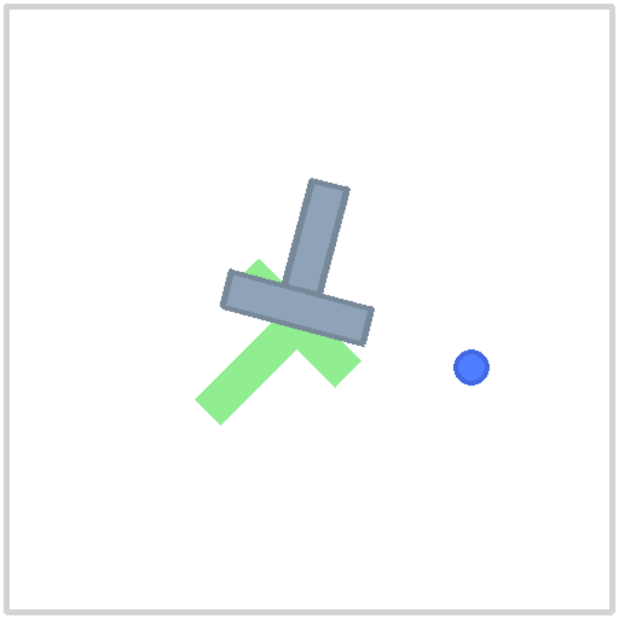

# flow-policy

## Project framing

This is **not** a VLA. It is a small, honest artifact: a language-conditioned
imitation-learning policy with a flow-matching action head, trained on a toy
manipulation task, wrapped in a ROS2 interface. The point is to demonstrate real
engineering decisions (conditioning, multimodal action generation, action
chunking, deployment plumbing) at a scale that's actually verifiable in a
weekend — not to overclaim scope.

## Status

- [x] Milestone 0 — environment setup
- [ ] Milestone 1 — task env + scripted expert data collection
- [ ] Milestone 2 — dataset + dataloader
- [ ] Milestone 3 — vision + language conditioning encoder
- [ ] Milestone 4 — flow-matching action head
- [ ] Milestone 5 — training loop + sanity checks
- [ ] Milestone 6 — inference: ODE sampling + action chunking
- [ ] Milestone 7 — evaluation harness + metrics
- [ ] Milestone 8 — ROS2 wrapper
- [ ] Milestone 9 — README, video, polish

## Milestone 0 — Environment setup

Task/env: [`gym-pusht`](https://github.com/huggingface/gym-pusht) (PushT), installed via `uv`.

```bash
uv sync
uv run python scripts/smoke_test_env.py
```

Confirms `reset`/`step`/`render` all work end-to-end and saves a GIF of a
random-action rollout to `assets/smoke_test_random_rollout.gif`.

Note: `gym-pusht` declares `pymunk>=6.6.0`, but pymunk 7.x removed
`Space.add_collision_handler`, which `gym-pusht==0.1.6` still relies on. Pinned
`pymunk<7` in `pyproject.toml` to work around this.


